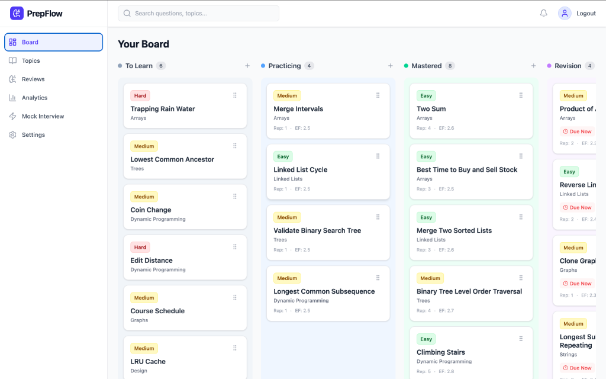
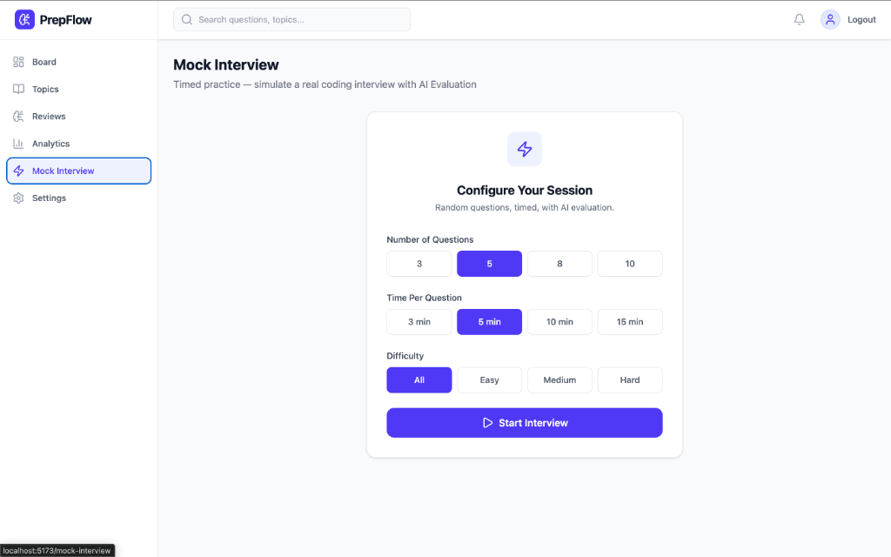
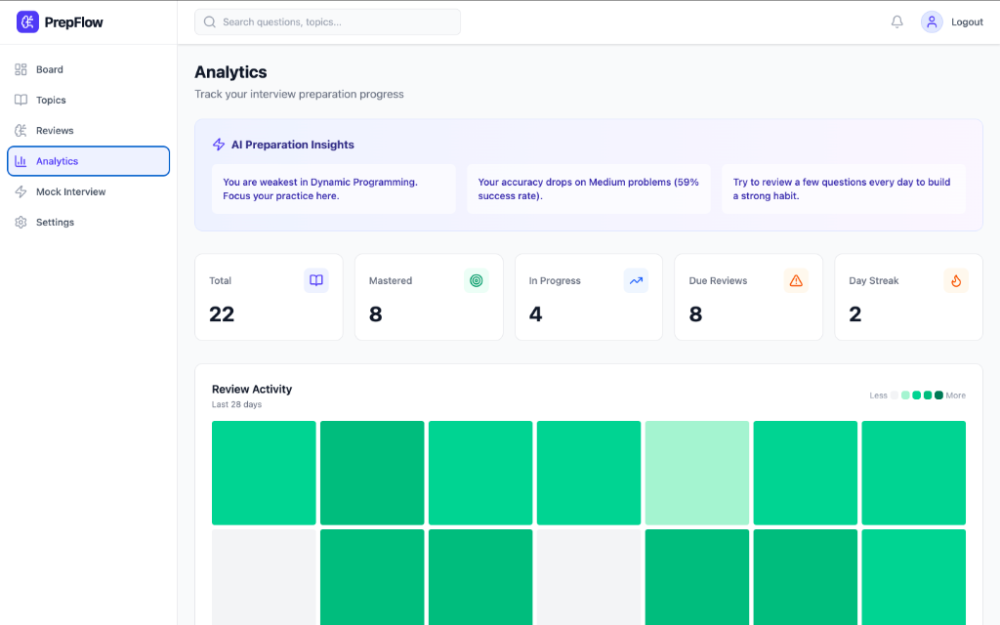
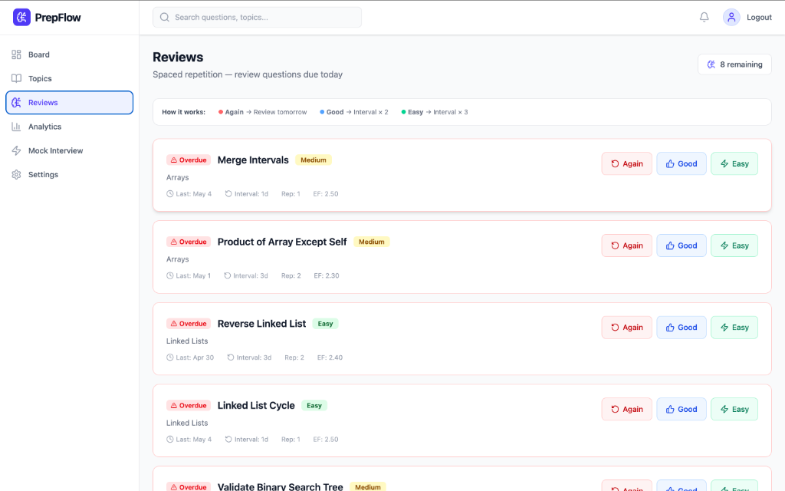

# PrepFlow 🚀
> A Production-Ready AI-Powered Interview Preparation Platform

PrepFlow is a robust, full-stack web application designed for software engineers to master data structures, algorithms, and system design concepts. It combines a modern Kanban workflow, a mathematically rigorous Spaced Repetition System (SM-2), and an AI-powered Mock Interview evaluator.


---

## ✨ System Architecture

```text
                  +-------------------+
                  |   React Frontend  |
                  | (Vite, Redux, Dnd)|
                  +--------+----------+
                           |
                           | REST API (JWT Auth)
                           v
                  +--------+----------+
                  |  FastAPI Backend  | 
                  |  (Rate Limiting,  | 
                  |   Pydantic Val.)  |
                  +--------+----------+
                           |
       +-------------------+-------------------+
       |                   |                   |
       v                   v                   v
+-------------+     +-------------+     +-------------+
|   MongoDB   |     | SM-2 Engine |     | AI Engine   |
| (Motor Async|     | (Spaced Rep)|     | (Mock Intv.)|
+-------------+     +-------------+     +-------------+
```

## 📸 Screenshots

<p align="center">
  
  &nbsp;
  
</p>
<p align="center">
  
  &nbsp;
  
</p>

---

## 🔥 Features & Capabilities

| Feature | Description |
|---------|-------------|
| 🤖 **AI Mock Interviews** | Simulated, timed interviews. Enter your solution and receive AI-driven scoring (0-100), strength analysis, and improvement feedback. |
| 🧠 **True SM-2 Spaced Repetition** | Uses the formal SuperMemo-2 algorithm. Interval and Ease Factor (`EF = EF + (0.1 - (5-q)*(0.08+(5-q)*0.02))`) computed on the backend. |
| 📊 **Analytics Insight Engine** | Goes beyond charts. Computes your weakest topics, hardest difficulty drop-offs, and 30-day consistency score. |
| 📋 **Kanban Board** | Highly optimized drag-and-drop board with column grouping, due-date pulse animations, and optimistic UI updates. |
| 🛡️ **Backend Hardening** | Global in-memory rate limiting, Request logging middleware, Pydantic input validation, and MongoDB indexing. |

---

## 📸 Core Pages

| Page | Route | Description |
|------|-------|-------------|
| Board | `/` | Kanban drag-and-drop board |
| Topics | `/topics` | All topics with progress tracking |
| Topic Detail | `/topics/:id` | Debounced search and difficulty filtering |
| Reviews | `/reviews` | SM-2 Spaced repetition review session |
| Analytics | `/analytics` | Real-time charts, GitHub-style heatmaps, and AI insights |
| Mock Interview | `/mock-interview` | Timed interview simulator with AI grading |

---

## 🚀 Deployment Guide

This project is built for modern serverless and PaaS deployment.

### 1. Frontend (Vercel)
1. Push your repository to GitHub.
2. Go to [Vercel](https://vercel.com) and import the project.
3. Set the Framework Preset to **Vite**.
4. Set the Root Directory to `frontend`.
5. Add Environment Variable:
   - `VITE_API_URL=https://your-backend-url.onrender.com`

### 2. Backend (Render / Railway)
1. Create a new Web Service on Render/Railway.
2. Connect the repository and set Root Directory to `backend`.
3. Build Command: `pip install -r requirements.txt`
4. Start Command: `uvicorn main:app --host 0.0.0.0 --port $PORT`
5. Environment Variables:
   - `MONGODB_URL`: Your MongoDB Atlas connection string.
   - `SECRET_KEY`: A strong secure random string.
   - `CORS_ORIGINS`: `https://your-vercel-app.vercel.app`

### 3. Database (MongoDB Atlas)
1. Create a free cluster on [MongoDB Atlas](https://mongodb.com).
2. Go to Database Access and create a user (username/password).
3. Go to Network Access and allow IP `0.0.0.0/0`.
4. Copy the connection string into your Backend Environment Variables.

---

## 💻 Local Setup Instructions

### 1. Clone the repository
```bash
git clone https://github.com/1tsadityaraj/PrepFlow.git
cd PrepFlow
```

### 2. Backend Setup
```bash
cd backend
python -m venv venv
source venv/bin/activate  # On Windows: venv\Scripts\activate
pip install -r requirements.txt
# Run the server (auto-seeds mock data in-memory for testing)
uvicorn main:app --reload
```

### 3. Frontend Setup
```bash
cd frontend
npm install
npm run dev
```

The app will be running at `http://localhost:5173`.

---

## 📄 Resume Bullet Points

- **Architected and developed a full-stack interview preparation platform** using React, Tailwind CSS, FastAPI, and MongoDB, achieving a robust, scalable architecture with global rate limiting and comprehensive Pydantic request validation.
- **Implemented a mathematically rigorous Spaced Repetition System (SM-2)** on the backend, tracking User Ease Factor and optimal intervals to maximize long-term retention of algorithmic concepts.
- **Integrated an AI-powered Mock Interview Simulator**, enabling users to take timed, randomized assessments and receive instantaneous, multi-faceted feedback (score, strengths, weaknesses) via a custom evaluation engine.
- **Engineered an Analytics Intelligence Layer** that processes 30-day user activity data to render GitHub-style heatmaps, identify weak topics, calculate consistency scores, and provide actionable study insights using Recharts.
- **Optimized frontend performance** by implementing debounced search inputs, `useMemo`/`React.memo` for component virtualization, and robust Redux state management across a highly interactive drag-and-drop Kanban workflow.
